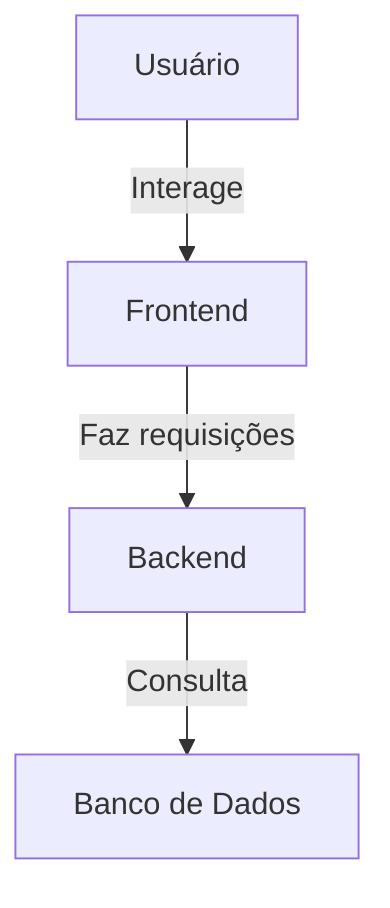

# DevEstudo

Sistema colaborativo para estudo com fórum, grupos e mentoria, conectando alunos e mentores.

---

## 🎯 Objetivo

Permitir que usuários:

- Tirem dúvidas no fórum
- Participem de grupos de estudo
- Recebam orientação de mentores

---

## 📦 Estrutura do Projeto (Monorepo)

Este projeto utiliza arquitetura monorepo.

```bash
devestudo/
  ├── frontend/
  │   ├── src/
  │   │   ├── components/
  │   │   ├── pages/
  │   │   ├── services/
  │   │   ├── hooks/
  │   │   ├── utils/
  │   │   └── App.jsx
  │   ├── public/
  │   │   ├── index.html
  │   │   └── assets/
  │   ├── package.json
  │   ├── vite.config.js
  │   └── .env
  └── backend/
      ├── src/
      ├── prisma/
      ├── package.json
      └── .env
```

---

## 🗄️ Banco de Dados

O banco de dados utilizado neste projeto será o **Supabase**, uma solução de backend como serviço (BaaS) que fornece um banco de dados PostgreSQL com funcionalidades adicionais, como autenticação e armazenamento.

### Configuração do Supabase

1. Crie uma conta no [Supabase](https://supabase.com/).
2. Crie um novo projeto.
3. Copie a URL e a chave de API do projeto.
4. Atualize o arquivo `.env` no backend com as seguintes variáveis:

```bash
DATABASE_URL=postgresql://<usuario>:<senha>@<host>:<porta>/<database>
SUPABASE_URL=https://<sua-url>.supabase.co
SUPABASE_KEY=<sua-chave-api>
```

5. Execute as migrações do Prisma:

```bash
npx prisma migrate dev
```

6. Acesse o painel do Supabase para gerenciar os dados e verificar as tabelas criadas.

---

## ⚙️ Setup

### Backend

```bash
cd backend
npm install
npx prisma init
```

Criar `.env`:
```bash
DATABASE_URL=link_do_supabase
```

Rodar:
```bash
npx prisma migrate dev
npm run dev
```

### Frontend

```bash
cd frontend
npm install
npm run dev
```

### Instalando o Vite

Para instalar o Vite, siga os passos abaixo:

1. Certifique-se de que o Node.js está instalado no seu sistema. Você pode baixá-lo no [site oficial do Node.js](https://nodejs.org/).
2. Execute o seguinte comando para criar um novo projeto com o Vite:

   ```bash
   npm create vite@latest
   ```

3. Siga as instruções no terminal para configurar o projeto. Escolha o framework e as opções desejadas.
4. Navegue até o diretório do projeto e instale as dependências:

   ```bash
   cd nome-do-projeto
   npm install
   ```

5. Inicie o servidor de desenvolvimento:

   ```bash
   npm run dev
   ```

Para mais detalhes, consulte a [documentação oficial do Vite](https://vitejs.dev/).

---

## Autenticação (OBRIGATÓRIO)

- Usar **JWT**
- Login deve retornar token
- Rotas protegidas devem validar token

### Regras obrigatórias:

- Token deve conter:
  - `id` do usuário
  - `role` do usuário
- Implementar middleware de autenticação
- Implementar middleware de autorização por role (RBAC)
- Todas as rotas (exceto login/register) devem ser protegidas

---

## Regras de Negócio

### Usuário

- `id`
- `nome`
- `email`
- `senha`
- `role`

### Fórum

- **Usuário** → **Thread** (1:N)
- **Thread** → **Resposta** (1:N)
- **Resposta** possui campo `votes` para contagem de votos


#### Regras obrigatórias:

- Thread deve possuir autor válido (`userId`)
- Resposta deve obrigatoriamente estar vinculada a uma thread existente
- Não permitir respostas órfãs

#### Sistema de votos (OBRIGATÓRIO):

- Votos são aplicados em respostas
- Cada resposta possui contagem de votos 
- Deve impedir múltiplos votos indevidos pelo mesmo usuário


#### Resposta deve conter:

- `userId`
- `threadId`
- `content`

### Grupos

- **Usuário** ↔ **Grupo** (N:N)
- **GrupoMembros** com:
  - `userId`
  - `grupoId`
  - `status` (PENDING, APPROVED)

#### Regras obrigatórias:

- Entrada no grupo = **PENDING**
- Apenas o **mentor do grupo** pode aprovar ou remover membros
- Máximo de **10 membros com status APPROVED por grupo**
- Mentor **não conta como membro**
- Usuário não pode entrar duas vezes no mesmo grupo
- Deve validar existência do grupo antes de qualquer ação

### Mentoria

- **mentorId**
- **studentId**
- **status** (REQUESTED, APPROVED, COMPLETED, CANCELLED)
- **nota** (opcional, 1 a 5)
- **comentário** (opcional)

#### Regras obrigatórias:

- Apenas usuários com role **STUDENT** podem solicitar mentoria
- Apenas usuários envolvidos podem avaliar
- Nota deve ser validada (intervalo permitido)

---

## REGRAS DE ACESSO (RBAC)

### ALUNO

Pode:

- Criar, editar e deletar próprios tópicos
- Responder tópicos
- Solicitar entrada em grupos
- Sair de grupos
- Deletar própria conta

### MENTOR

Pode:
- Usar todas as funcionalidades de aluno
- Criar e gerenciar grupos
- Aprovar usuários
- Remover usuários
- Criar e gerenciar conteúdos próprios

### ADMIN

- Controle total do sistema

### Regras gerais de acesso:

- Todas as ações devem validar o `userId` autenticado
- Usuário só pode alterar/deletar seus próprios dados
- Ações sensíveis devem validar role (ex: apenas mentor gerencia grupo)
---

## Padrão de Resposta da API

### Sucesso

```json
{ "success": true, "data": {} }
```

### Erro

```json
{ "success": false, "message": "Erro descritivo" }
```

---

## Validação de Dados

- Email válido
- Senha mínimo 6 caracteres
- Todos os campos obrigatórios
- Email único

---

## Exemplos de Uso

### Exemplo de Chamada de API

#### Criar Usuário

**Endpoint:**
```http
POST /register
```

**Body:**
```json
{
  "nome": "João Silva",
  "email": "joao@email.com",
  "senha": "123456",
  "role": "STUDENT"
}
```

**Resposta:**
```json
{
  "success": true,
  "data": {
    "id": 1,
    "nome": "João Silva",
    "email": "joao@email.com",
    "role": "STUDENT"
  }
}
```

## Validações obrigatórias do Backend

O sistema será considerado inválido se:

- Rotas não estiverem protegidas com JWT
- Senhas devem ser obrigatoriamente criptografadas com bcrypt
- Controle de acesso por role não estiver implementado
- Limite de grupo (10 membros) não for respeitado
- Sistema de votos não impedir duplicidade
- Respostas não estiverem vinculadas corretamente às threads
- Regras de negócio não forem validadas
---

## 👥 Divisão da Equipe

### Daniely – Fullstack / Integração

Deve fazer:

- Setup do projeto
- Configurar Prisma (setup inicial e schema) + banco
- Organizar estrutura de pastas
- Integrar frontend + backend
- Revisar PRs do banckend 
- Revisar models
- Rodar migrations finais
- Testar sistema completo

Entregável obrigatório:

- Sistema funcionando completo (frontend + backend + banco)

Reprova nos testes se:

- Integração não funciona
- Banco não mantem refistros
- Backend não conecta
- Sistema não roda

---

### Antonio – Backend (Auth + User + Mentoria + Grupos)

#### Models obrigatórios

- **User** (student, mentor e admin)
- **Mentoring**
- **Group** (limitar há 10 participantes por grupo, sem
incluir o mentor)
- **GrupoMembros** (listagem de membros e opções de gerenciamento dos mesmos)

#### USER

Rotas obrigatórias:

- **POST** /register
- **POST** /login
- **PUT** /profile
- **GET** /user/:id
- **DELETE** /user

Deve obrigatoriamente:

- Usar **bcrypt**
- Usar **JWT**
- Implementar role

#### MENTORIA

Rotas:

- **GET** /mentors
- **POST** /mentoria
- **POST** /avaliar

#### GRUPOS

Rotas:

- **POST** /groups
- **GET** /groups
- **POST** /groups/join
- **POST** /groups/approve
- **POST** /groups/remove
- **POST** /groups/leave

Regras obrigatórias:

- Entrada = PENDENTE
- Apenas mentor aprova/remove

#### Testes obrigatórios

- TODAS rotas testadas no Postman

Reprova nos testes se:

- Não usar JWT
- Não usar bcrypt
- Não testar
- Role não implementado

---

### José – Backend (Fórum)

#### Models

- **Thread**
- **Resposta**

#### Rotas

- **POST** /threads
- **GET** /threads
- **GET** /threads/:id
- **POST** /reply
- **POST** /vote

Deve:

- Criar threads
- Criar respostas
- Implementar votos nas respostas

#### Testes obrigatórios

- Tudo funcionando no Postman

Reprova nos testes se:

- Voto não funciona
- Relação incorreta
- Não testado

---

### Lucas – Frontend

Deve fazer:

- Login
- Cadastro
- Dashboard
- Navbar
- Tela de grupos

Funcionalidades:

- Login funcionando
- Listar grupos
- Entrar no grupo
- Sair do grupo

Integração obrigatória:

- **/login**
- **/groups**
- **/groups/join**
- **/groups/leave**

Reprova nos testes se:

- Não conecta com API
- Login não funciona

---

### Rilton – Frontend

Deve fazer:

- Fórum
- Thread
- Mentoria

Funcionalidades:

- Criar thread
- Responder
- Listar
- Solicitar mentoria
- Avaliar

Integração obrigatória:

- **/threads**
- **/reply**
- **/mentoria**
- **/avaliar**

Reprova nos testes se:

- Não funciona com backend
- Formulários não funcionam

---

## Checklist de Entrega Obrigatório

### Backend

- Todas rotas funcionando no Postman
- JWT funcionando
- bcrypt funcionando
- Prisma funcionando
- Banco conectado

### Frontend

- Login funciona
- Integra com API
- Telas carregam dados
- Formulários enviam dados

### Sistema

- Backend conecta com frontend
- Banco responde corretamente
- Fluxo completo funciona

---

## Git

- Não fazer commit na main
- Criar branch para cada funcionalidade
- Abrir PR após terminar a funcionalidade
- Avisar no grupo para revisão
- Outro membro revisa e aprova (ou solicita mudanças)
- Merge só após aprovação

---

## Etapas

1. Setup + Login
2. Fórum
3. Grupos + Mentoria
4. Integração

---

## Critérios de Aceitação

Projeto será considerado incompleto se houver:

- Falta de JWT
- Falta de RBAC
- Falta de integração
- Funcionalidade quebrada
- Código não testado

---

## Links Úteis

- [Documentação do Prisma](https://www.prisma.io/docs/)
- [Documentação do Vite](https://vitejs.dev/guide/)
- [Node.js](https://nodejs.org/)
- [React](https://react.dev/)

---

## Diagrama da Arquitetura



---

## Licença

Este projeto está licenciado sob a [MIT License](LICENSE).

